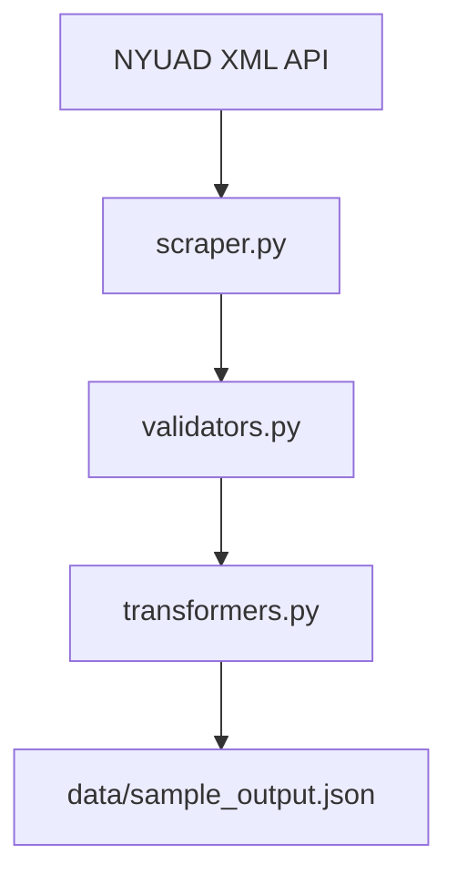

# NYUAD Course Scraper

## Executive Summary
This project scrapes and structures course data from **New York University Abu Dhabi’s course catalog**.  
The official catalog is rendered with JavaScript, which makes standard HTML scraping return no results.  

By inspecting network requests, we discovered a **hidden XML API** that contains all course records in a structured format.  
Our scraper fetches this data, validates and transforms it, and outputs a clean JSON file.  

This dataset helps:
- **Students**: plan courses more easily.  
- **Advisors**: understand curriculum balance.  
- **Researchers**: study trends in course offerings.  

---

## Problem Statement & Motivation
The NYUAD course catalog is difficult to search, filter, or analyze in bulk.  
Students struggle to plan across semesters, advisors spend time manually referencing the catalog, and researchers lack structured data for analysis.  

Our solution unlocks ~1,800 courses in one request, producing a JSON dataset that can be reused for planning tools, dashboards, and academic studies.  

---

## Features
- Fetches all course data from the NYUAD public XML API.  
- Implements retries and exponential backoff (respectful scraping).  
- Validates required fields (`code`, `title`).  
- Transforms fields (capitalization, credits → integers).  
- Outputs JSON with ~1,800 records at `data/sample_output.json`.  

---

## Repository Structure
```
project-name/
├── src/
│ ├── scraper.py # Main scraping logic
│ ├── validators.py # Data validation rules
│ ├── transformers.py # Data transformation pipeline
├── docs/
│ ├── ARCHITECTURE.md # Technical design decisions
│ ├── AI_USAGE.md # AI collaboration documentation
│ ├── BUSINESS_CASE.md # Business pitch
│ ├── ETHICS.md # Ethical/legal notes
├── data/
│ └── sample_output.json # Example scraped data
├── requirements.txt
├── README.md
└── .gitignore
```

---

## Technical Architecture


### Flowchart 




## Performance Metrics
- **API calls per run**: 1 (bulk download).  
- **Records per run**: ~1,820.  
- **Error rate**: 0% (with retries).  
- **Run time**: ~2 seconds.  

---

## Environment Setup
Clone this repository and set up a virtual environment:

```bash
# Create virtual environment
python3 -m venv .venv

# Activate it (Linux/Mac/WSL)
source .venv/bin/activate

# Install dependencies
pip install -r requirements.txt
```
## Run Instructions
```
cd src
python scraper.py
```
**Output will be saved to:**
```
../data/sample_output.json
```
## Ethical & Legal Notes

- Scraper respects robots.txt and uses only public API endpoints.

- No personal data (PII) is collected.

- Data is stored in JSON for educational/research use only.

## License

Educational use only. Not for commercial redistribution of scraped data.
